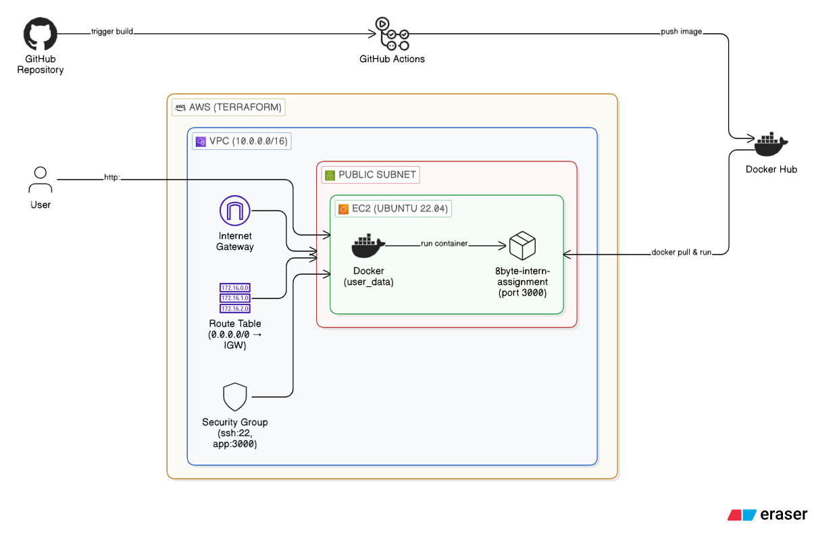
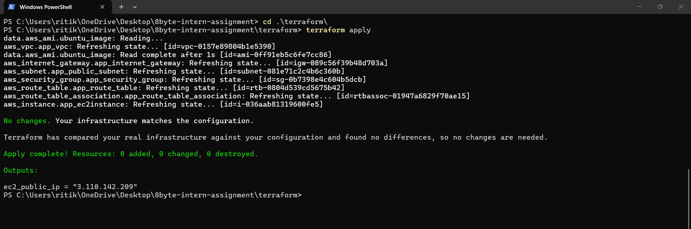
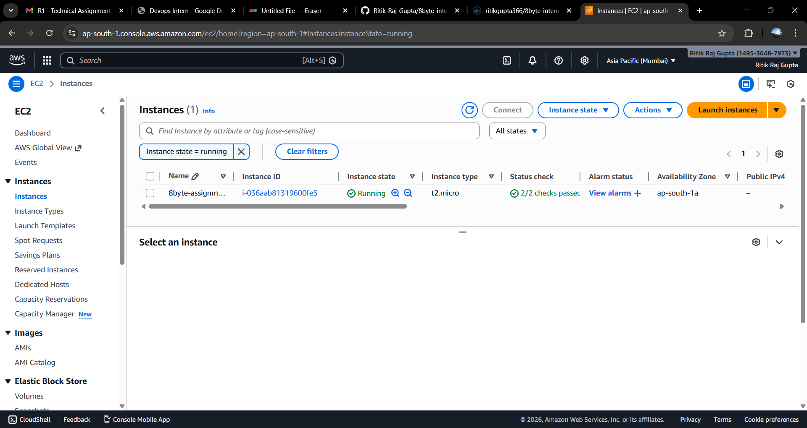
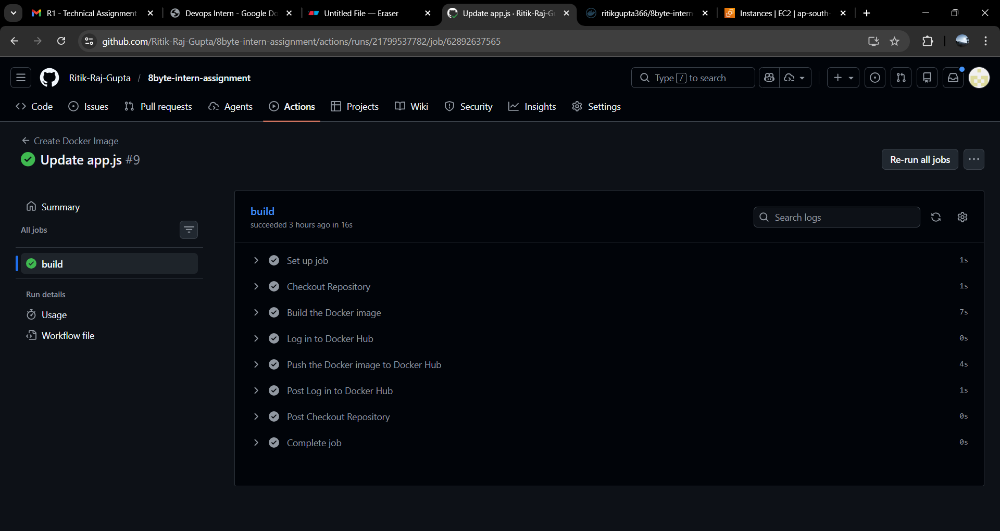
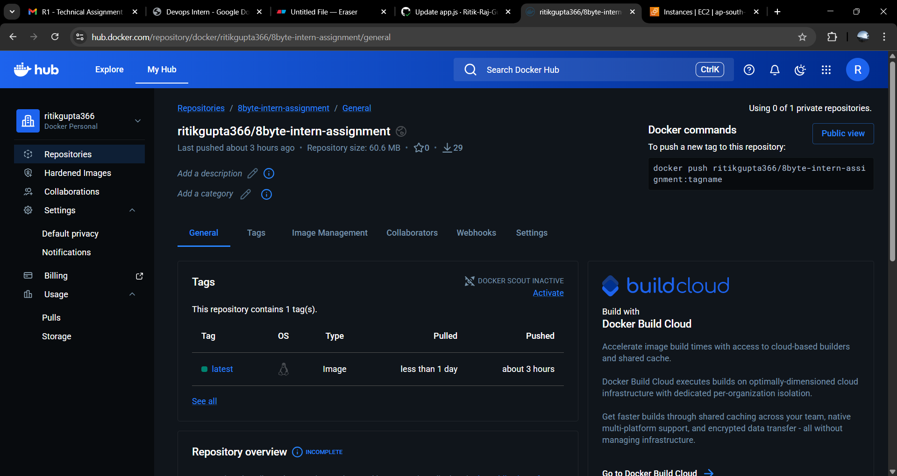

# 8byte DevOps Intern Assignment

## Project Overview

This project demonstrates deploying a containerized Node.js (Express) application on AWS. It includes:

- Application: A simple Node.js server that serves a success message on port 3000.
- Containerization: Docker image built from an Alpine-based Dockerfile.
- Infrastructure as Code: Terraform provisions a VPC, public subnet, security group, and an EC2 instance with Docker installed.
- CI/CD: GitHub Actions builds the Docker image on every push to `main` and pushes it to Docker Hub.

The application is containerized using Docker and deployed on an EC2 instance provisioned via Terraform.
---

## Assignment Deployment Details
- **Application URL**: http://3.110.142.209:3000
- **Dockerhub Url**: https://hub.docker.com/repository/docker/ritikgupta366/8byte-intern-assignment/general
- **GitHub Repository**: https://github.com/Ritik-Raj-Gupta/8byte-intern-assignment

---
Architecture Diagram



---

## Steps to Run the Application Locally

**Prerequisites**: Node.js (v18+) and npm should be installed.

1. Create the `app/` directory (if it does not exist). Create `app/app.js` and `app/package.json` and paste the following content into the respective files.

   **app/package.json**:
   ```json
   {"name":"8byte-intern-assignment","version":"1.0.0","dependencies":{"express":"^4.18.2"}}
   ```

   **app/app.js**:
   ```javascript
   const express = require('express');
   const app = express();
   app.get('/', (req, res) => {
     res.send('8byte Intern Assignment Successfully Deployed ');
   });
   app.listen(3000, () => {
     console.log('Server running on port 3000');
   });
   ```

2. Install dependencies and start the server:
   ```bash
   cd app
   npm install
   node app.js
   ```
3. Open a browser and go to:
   **http://localhost:3000**
   You should see the success message from the application.

---

## Steps to Build the Docker Image

**Prerequisites**: Docker should be present.

1. Open a terminal in the location where the `Dockerfile` is.
2. Build the image:
   ```bash
   docker build -t 8byte-intern-app .
   ```
3. Run the container:
   ```bash
   docker run -p 3000:3000 8byte-intern-app
   ```
4. In a browser, open:
   **http://localhost:3000**

---

## Steps to Provision Infrastructure Using Terraform

**Prerequisites**: Terraform installed, AWS CLI configured (or environment variables set) with credentials that can create VPC, EC2, and related resources. An EC2 key pair must exist in the target region for SSH.

1. Go to the Terraform directory:
   ```bash
   cd terraform
   ```
2. Create or edit `terraform.tfvars` with your values, for example:
   ```hcl
   region           = "ap-south-1"
   vpc_cidr         = "10.0.0.0/16"
   subnet_cidr      = "10.0.1.0/24"
   instance_type    = "t2.micro"
   ec2_ssh_key_name = "your-ec2-key-pair-name"
   ```
3. Initialize and apply:
   ```bash
   terraform init
   terraform plan
   terraform apply
   ```
4. Note the output `ec2_public_ip`; you will use it to SSH and to open the app in a browser.

**What Terraform creates**:
- VPC  
- Public subnet with auto-assign public IP  
- Internet Gateway and route table (0.0.0.0/0 → IGW)  
- Security group (SSH on 22, app on 3000)  
- EC2 instance (Ubuntu 22.04) with Docker installed via `user_data`

### Terraform Apply Output



### EC2 Instance Status



---

## Steps to Deploy the Application on EC2
1. **SSH into the EC2 instance** (use the key that matches `ec2_ssh_key_name` and the IP from `terraform apply output`):
   ```bash
   ssh -i /path/to/your-key.pem ubuntu@<EC2_PUBLIC_IP>
   ```

2. **Deploy the app** using one of the following options.

   **Option A — Pull image from Docker Hub** (replace `<dockerhub-username>` with your Docker Hub username):
   ```bash
   sudo docker pull <dockerhub-username>/8byte-intern-assignment:latest
   sudo docker run -d -p 3000:3000 --name app <dockerhub-username>/8byte-intern-assignment:latest
   ```

   **Option B — Clone the repo and build locally**:
   ```bash
   git clone https://github.com/Ritik-Raj-Gupta/8byte-intern-assignment
   cd 8byte-intern-assignment
   sudo docker build -f Dockerfile -t 8byte-intern-assignment:latest .
   sudo docker run -d -p 3000:3000 --name app 8byte-intern-assignment:latest
   ```

3. **Verify**: In a browser, open:

   **http://<EC2_PUBLIC_IP>:3000**

   You should see the same success message as when running locally or in Docker.

### Application Running on EC2


---

## Explanation of the GitHub Actions Workflow

**Workflow file**: `.github/workflows/ci.yml`  
**Trigger**: Runs on every **push to the `main`** branch.

| Step | What it does |
|------|-------------------------------|
| **Checkout Repository** | Uses `actions/checkout@v4` to get the repo code. |
| **Build the Docker image** | Runs `docker build` from the repo root using the project `Dockerfile`, and tags the image as `${{ secrets.DOCKER_USERNAME }}/8byte-intern-assignment:latest`. |
| **Log in to Docker Hub** | Uses `docker/login-action@v3` with `DOCKER_USERNAME` and `DOCKER_PASSWORD` from GitHub Repository Secrets. |
| **Push the Docker image** | Pushes the built image to Docker Hub so it can be pulled on EC2 (or anywhere else). |

**Required GitHub Secrets** (Settings → Secrets and variables → Actions):

- `DOCKER_USERNAME`: Your Docker Hub username.  
- `DOCKER_PASSWORD`: Your Docker Hub password or access token (using access token is recommended over password).

When the workflow succeeds, the image `/<your-username>/8byte-intern-assignment:latest` is available on Docker Hub for deployment.

### GitHub Actions – Successful Workflow



### Docker Hub Image Repository


