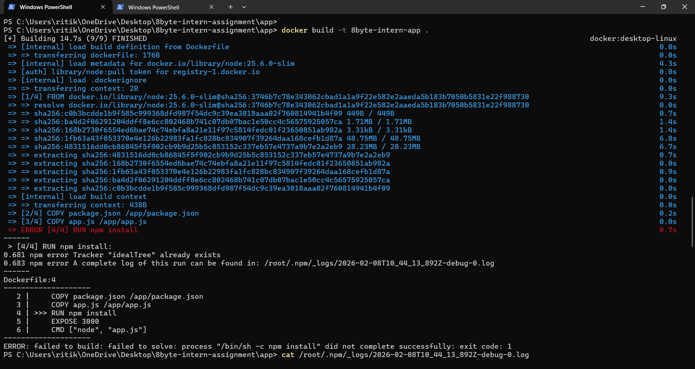
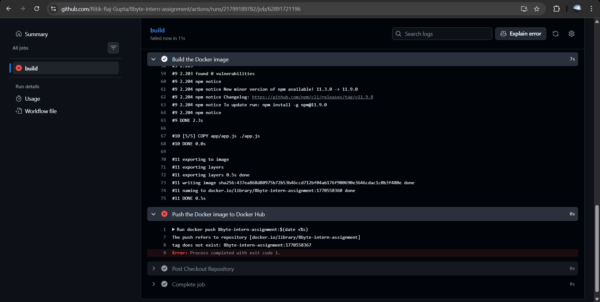
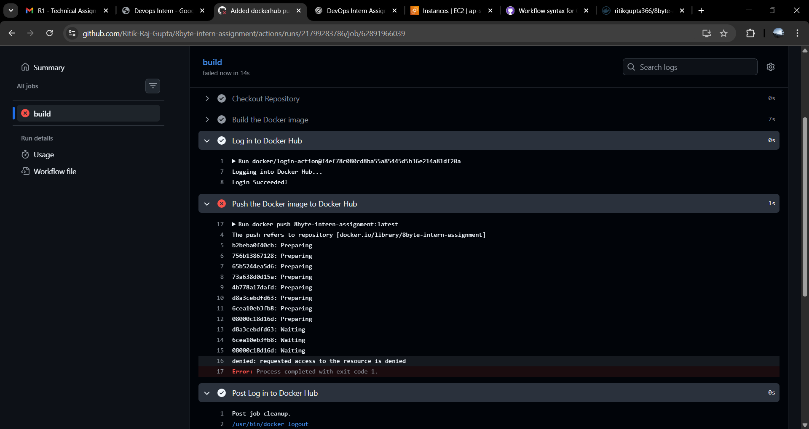

# Challenges Faced and Resolutions

## 1. Docker Build Failure (`idealTree already exists`)
**Issue**  
During Docker image builds, `npm install` failed with the error:

Tracker "idealTree" already exists

**Cause**  
The Dockerfile initially lacked a proper `WORKDIR`, and file copy order caused npm to behave unexpectedly during layer execution.

**Resolution**
- Added `WORKDIR /app` to ensure a consistent execution directory
- Ensured `package.json` is copied before running `npm install`
- Copied `app.js` only after dependencies were installed

This resolved the npm installation issue and stabilized Docker builds.

---

## 2. GitHub Actions – Image Tag Mismatch
**Issue**  
The CI pipeline failed while pushing images to Docker Hub due to mismatched tags between the `docker build` and `docker push` steps.

**Cause**  
Dynamic tags were generated at build time but not reused consistently during the push step.

**Resolution**
- Standardized on a single tag (`latest`) across both build and push steps
- Ensured the same image name and tag were used throughout the workflow

This fixed the Docker Hub push failures.

---

## 3. Docker Push Permission Denied
**Issue**  
Docker push failed with:

denied: requested access to the resource is denied

**Cause**  
The image was being pushed without the Docker Hub username namespace because there was n docker login before pushing image.

**Resolution**
- Added Docker Hub login using `docker/login-action@v3` (with `DOCKER_USERNAME` and `DOCKER_PASSWORD` in GitHub Repository Variables)
- Ensured the image was tagged as `<dockerhub-username>/image-name` so it pushes to my namespace

After logging in and using the correct tag, the push succeeded.